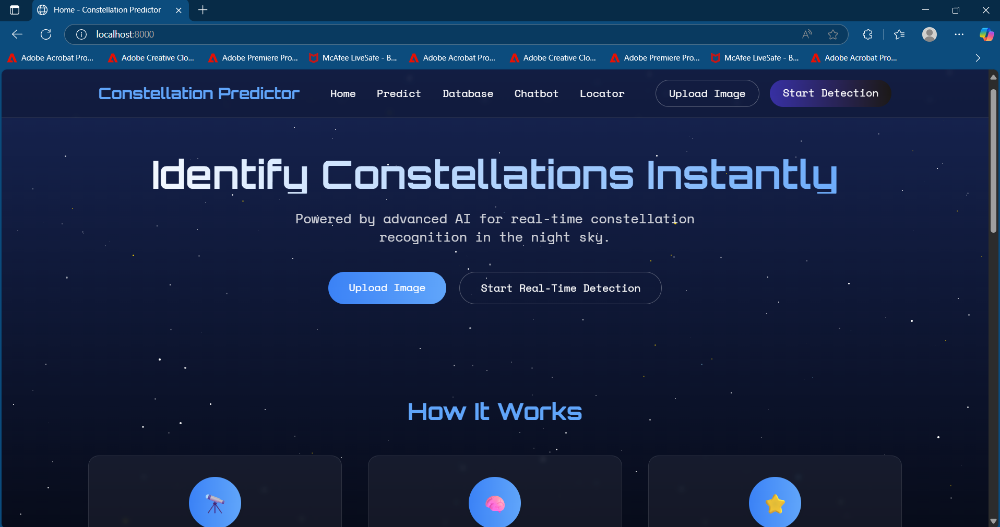
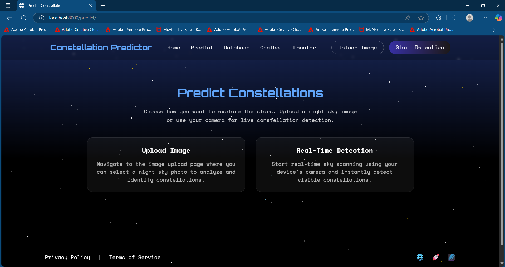
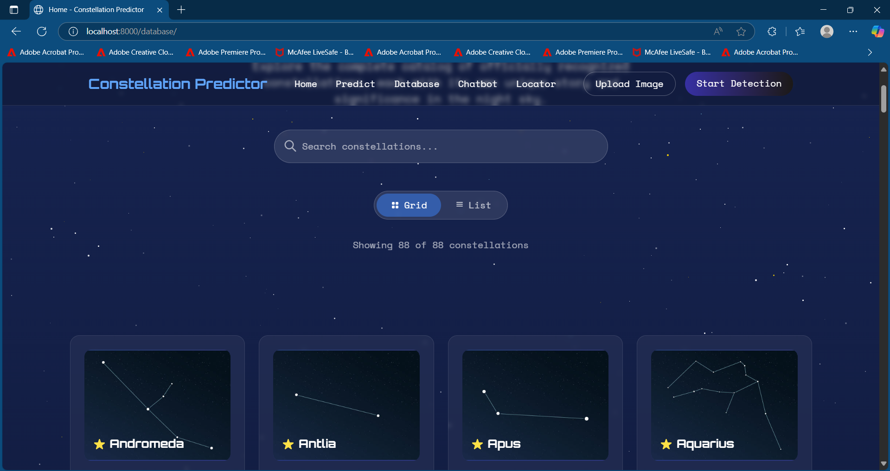
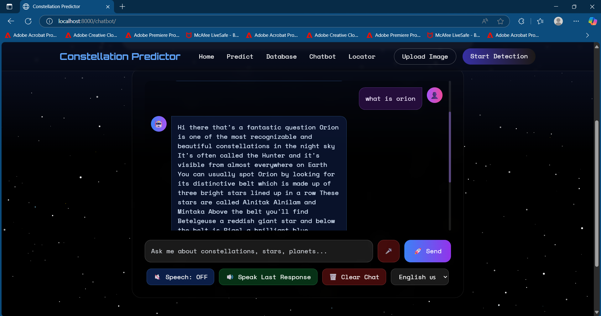
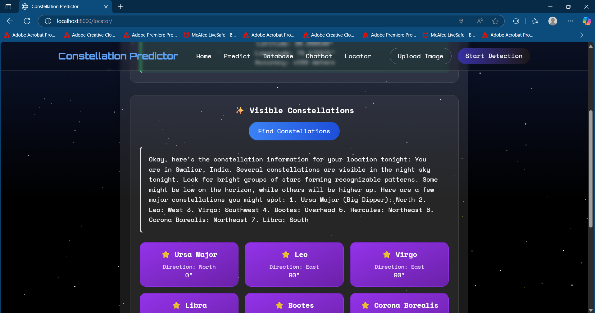
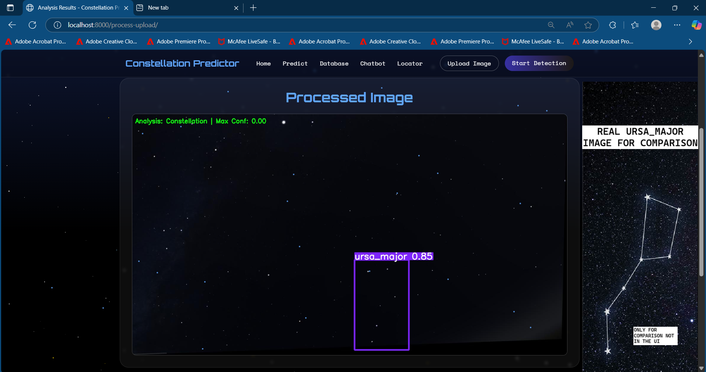
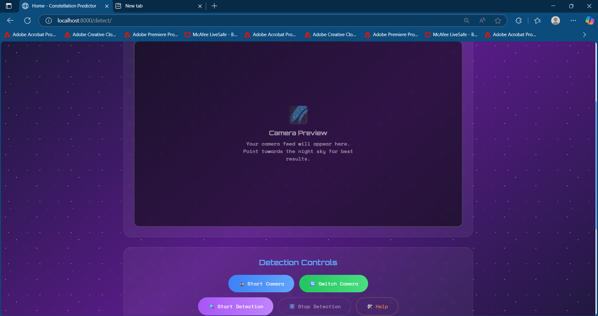

# Constellation Predictor 🌟

A comprehensive web application for constellation identification and exploration, featuring AI-powered image recognition, real-time location services, and multilingual chatbot assistance.

## Features

### 🔍 **Smart Constellation Detection**

- Upload images for AI-powered constellation identification
- Real-time database predictions with comprehensive constellation data
- Trained on COCO dataset to distinguish celestial objects from everyday items

### 🗺️ **Interactive Constellation Locator**

- GPS-based nearest constellation finder
- Built-in compass navigation for mobile devices
- Calibration features for accurate positioning

### 🤖 **Multilingual AI Chatbot**

- English and Hindi language support with optimized Whisper model
- Voice input and speech output capabilities
- Comprehensive constellation knowledge base

### 📊 **Complete IAU Database**

- Access to all 88 officially recognized constellations
- Detailed constellation information and metadata
- Interactive database exploration

## Installation

### Prerequisites

First, install `uv` package manager:

**Windows:**

```bash
winget install --id=astral-sh.uv -e
```

**macOS/Linux:**

```bash
# Using curl
curl -LsSf https://astral.sh/uv/install.sh | sh

# Or using wget
wget -qO- https://astral.sh/uv/install.sh | sh

# For specific version
curl -LsSf https://astral.sh/uv/0.7.16/install.sh | sh
```

### Setup Instructions

1. **Clone the repository:**

   ```bash
   git clone https://github.com/TanmayGupta-play/Constellation_predictor.git
   cd Constellation_predictor
   ```

   _Alternatively, download as ZIP from the [GitHub repository](https://github.com/TanmayGupta-play/Constellation_predictor)_

2. **Create virtual environment (if needed):**

   ```bash
   uv venv
   ```

3. **Install dependencies:**

   ```bash
   uv pip install -r requirements.txt
   ```

4. **Configure environment variables:**

   Create a `.env` file in the root directory (same folder as `manage.py`):

   ```env
   API-KEY="your_gemini_api_key_here"
   ```

   Get your Gemini API key from [Google AI Studio](https://studio.google.com/apikey)

5. **Setup database:**

   ```bash
   uv run python manage.py makemigrations
   uv run python manage.py migrate
   ```

6. **Run the application:**
   ```bash
   cd ConstellationPredictor
   uv run python manage.py runserver
   ```

### Troubleshooting

If you encounter dependency issues, return to the root folder and reinstall:

```bash
cd ..
uv pip install -r requirements.txt
```

## Usage

### Navigation Routes

The application provides several interactive routes accessible through the navigation bar:

#### 🏠 **Home Page**

Landing page with project overview and navigation


#### 🔮 **Predict**

Choose between uploaded image or real database prediction


#### 📚 **Database**

Browse all 88 IAU-recognized constellations


#### 🤖 **Chatbot**

AI assistant with voice support (English/Hindi)


#### 🧭 **Locator**

GPS-based constellation finder with compass navigation


#### 📤 **Upload**

Direct image upload interface


#### 🎯 **Detect**

Real-time constellation detection results


### Key Functionalities

#### 🖼️ **Image Upload & Detection**

- Support for various image formats
- AI-powered constellation identification
- Detailed results with constellation metadata

#### 🎤 **Voice Interaction**

- Speech-to-text input
- Text-to-speech output for responses
- Toggle speech mode on/off

#### 🧭 **Location Services**

- Automatic location detection
- Compass calibration for mobile devices
- Nearest constellation recommendations

## Testing

The repository includes dedicated testing resources:

### 📁 **Test Images** (`/test/` folder)

- Sample constellation images for model validation
- Use these images to test the upload and detection functionality
- Verify model accuracy with known constellation patterns
- Perfect for demonstrating the system capabilities

### 📸 **UI Screenshots** (`/images/` folder)

- Complete visual documentation of all application routes
- Reference images showing the user interface for each feature
- Helpful for understanding the application flow before installation

### Model Validation

## Model Training

- **Primary Dataset**: Custom constellation imagery
- **Validation Dataset**: COCO dataset integration
- **Purpose**: Prevents false positives from everyday objects
- **Accuracy**: Optimized for celestial object recognition

## Project Structure

```
Constellation_predictor-main/
├── images/                              # UI Screenshots for documentation
│   ├── home.png                         # Home page interface
│   ├── predict.png                      # Prediction selection page
│   ├── database.png                     # Constellation database view
│   ├── chatbot.png                      # AI chatbot interface
│   ├── locator.png                      # GPS locator with compass
│   ├── upload.png                       # Image upload interface
│   └── detect.png                       # Detection results display
├── test/                                # Test images for model validation
│   └── ...                              # Sample constellation images for testing
├── ConstellationPredictor/              # Main Django project directory
│   ├── chatbot/                         # Chatbot application
│   │   ├── templates/                   # Chatbot HTML templates
│   │   ├── views.py                     # Chatbot logic and AI integration
│   │   └── ...                          # Standard Django app files
│   ├── ConstellationPredictor/          # Django project settings
│   │   ├── settings.py                  # Project configuration
│   │   ├── urls.py                      # URL routing
│   │   └── ...                          # ASGI/WSGI configurations
│   ├── Locator/                         # GPS and compass functionality
│   │   ├── templates/Locator/           # Location-based templates
│   │   ├── models.py                    # Location data models
│   │   └── ...                          # Location services logic
│   ├── Predictor/                       # Core prediction engine
│   │   ├── REAL_TIME_DETECTOR/          # YOLO model training data
│   │   │   ├── runs/                    # Training results and metrics
│   │   │   │   ├── detect/              # Detection test results
│   │   │   │   └── train/               # Training performance data
│   │   │   ├── weights/                 # Pre-trained model weights
│   │   │   │   ├── best.pt              # Best performing model
│   │   │   │   └── last.pt              # Latest checkpoint
│   │   │   ├── yolo11n.pt               # YOLO v11 nano model
│   │   │   └── yolov8n.pt               # YOLO v8 nano model
│   │   ├── static/                      # Static assets
│   │   │   └── images/                  # Constellation image database (88 images)
│   │   │       ├── image0.webp          # IAU constellation #0
│   │   │       ├── image1.webp          # IAU constellation #1
│   │   │       └── ...                  # (Complete set of 88 constellations)
│   │   ├── templates/                   # Prediction interface templates
│   │   │   ├── base.html                # Base template layout
│   │   │   ├── database.html            # Constellation database view
│   │   │   ├── detect.html              # Detection results page
│   │   │   ├── home.html                # Landing page
│   │   │   ├── predict.html             # Prediction interface
│   │   │   ├── results.html             # Analysis results
│   │   │   └── upload.html              # Image upload interface
│   │   └── views.py                     # Prediction logic and ML integration
│   ├── db.sqlite3                       # SQLite database
│   ├── manage.py                        # Django management script
│   └── requirements.txt                 # Python dependencies
├── main.py                              # Standalone execution script
├── pyproject.toml                       # Project metadata and build config
├── README.md                            # Project documentation
├── requirements.txt                     # Root-level dependencies
└── uv.lock                              # UV package lock file
```

### Key Components Explained

#### 🧠 **Predictor Module**

The core of the application containing the machine learning pipeline:

- **REAL_TIME_DETECTOR**: Houses YOLO model configurations and training artifacts
- **Training Results**: Complete metrics including confusion matrices, F1 curves, and performance graphs
- **Model Weights**: Pre-trained YOLO models (v8 and v11) optimized for constellation detection
- **Static Images**: Complete database of all 88 IAU-recognized constellations in WebP format for optimal loading

#### 🤖 **Chatbot Module**

AI-powered conversational interface:

- Integrates with Google Gemini API for natural language processing
- Supports multilingual interactions (English/Hindi)
- Voice recognition and text-to-speech capabilities

#### 🗺️ **Locator Module**

Location-based constellation finding:

- GPS integration for position detection
- Compass calibration for mobile devices
- Real-time constellation positioning algorithms

#### 📊 **Training Data & Models**

- **YOLO Integration**: Custom-trained YOLO models for constellation detection
- **COCO Dataset Validation**: Prevents false positives from terrestrial objects
- **Performance Metrics**: Comprehensive training results with visual analytics
- **Model Versioning**: Multiple model checkpoints for optimal performance

## Technology Stack

- **Backend**: Django/Python
- **AI/ML**: YOLO v8/v11 with custom constellation training
- **Computer Vision**: OpenCV and custom detection algorithms
- **APIs**: Google Gemini AI integration
- **Location Services**: GPS/Compass integration with mobile calibration
- **Audio**: Speech recognition and synthesis
- **Database**: SQLite with Django ORM for constellation metadata
- **Frontend**: HTML5, CSS3, JavaScript with responsive design
- **Image Processing**: WebP optimization for fast loading

## Contributing

1. Fork the repository
2. Create a feature branch (`git checkout -b feature/AmazingFeature`)
3. Commit your changes (`git commit -m 'Add some AmazingFeature'`)
4. Push to the branch (`git push origin feature/AmazingFeature`)
5. Open a Pull Request

## Configuration & Optimization

### Audio Processing Enhancement

For improved Hindi language support in the chatbot, update the Whisper model configuration:

**File**: `chatbot/views.py`

Change the following line:

```python
# Default configuration
whisper_model = whisper.load_model("base")

# Enhanced Hindi support
whisper_model = whisper.load_model("medium")
```

**Model Size Comparison:**

- `base`: Faster processing, basic multilingual support
- `medium`: Better accuracy for Hindi speech recognition, slightly slower processing
- Recommended for production use with Hindi audio input

### Environment Configuration

## License

This project is open source. Please check the repository for specific license information.

## Support

For issues, questions, or contributions, please visit the [GitHub repository](https://github.com/TanmayGupta-play/Constellation_predictor) or open an issue.

---

**Explore the cosmos with AI-powered precision! 🌌✨**
